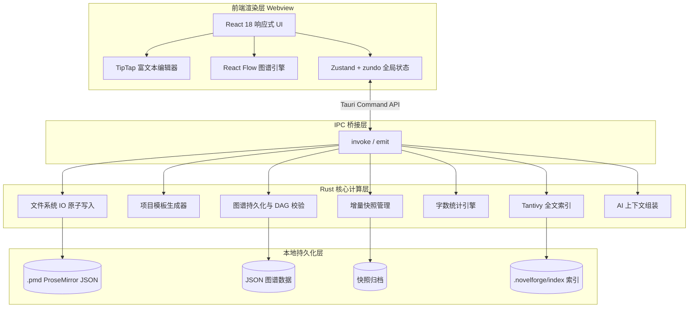

<div align="center">

# 喵创说 (MiaoChuangShuo)

**长篇小说离线创作桌面工作站**

将项目管理、大纲规划、章节写作、人物图谱、剧情时间线、设定库、全文搜索与 AI 助手集成于单一 Windows 桌面应用, 让长篇创作者无需在多个软件之间切换即可完成从立意到连载的全流程作业。

</div>

---

[](https://github.com/fanquanpp/MiaoChuangShuo/releases)
[](https://tauri.app/)
[](https://react.dev/)
[](https://www.rust-lang.org/)
[](./LICENSE)
[](https://github.com/fanquanpp/MiaoChuangShuo/releases)

---

## 下载与访问

- **桌面安装包 (MSI / NSIS, 完整功能)**: [GitHub Releases](https://github.com/fanquanpp/MiaoChuangShuo/releases)
- **Web 在线体验版 (核心编辑功能, IndexedDB 持久化)**: [https://fanquanpp.github.io/MiaoChuangShuo/](https://fanquanpp.github.io/MiaoChuangShuo/)
- **项目展示页 (特性与界面预览)**: [https://fanquanpp.github.io/MiaoChuangShuo/docs/](https://fanquanpp.github.io/MiaoChuangShuo/docs/)
- **源码仓库**: [https://github.com/fanquanpp/MiaoChuangShuo](https://github.com/fanquanpp/MiaoChuangShuo)

> 桌面版提供完整功能 (全文搜索、AI 助手、人物图谱、时间线、设定库、版本快照、Tantivy 索引等); Web 版用于快速试用核心创作体验。

---

## 创作工作流

喵创说围绕"一部百万字长篇小说"的生命周期组织界面与模块。工作台采用三栏布局, 左侧导航通过 `Alt+1` ~ `Alt+7` 在七个创作场景间切换, 中间内容区随分类切换为对应面板, 右侧为文件列表。

| 快捷键 | 场景 | 模块 | 说明 |
|--------|------|------|------|
| Alt+1 | 正文 | NovelEditor | 章节写作主战场, 百万字级 TipTap 文档 |
| Alt+2 | 大纲 | OutlineToChapters | 大纲写完后一键批量生成章节文件 |
| Alt+3 | 设定 | CodexPanel | 角色/世界观/术语/资料卡片库 |
| Alt+4 | 统计 | WritingStats | 会话字数 / WPM / 字数目标 |
| Alt+5 | 搜索 | GlobalSearch | 精确匹配 + Tantivy 语义检索双后端 |
| Alt+6 | 人图 | CharacterGraphPanel | 人物关系网 |
| Alt+7 | 时间线 | TimelinePanel | 剧情节点 DAG, DFS 三色校验无环 |

**跨场景能力**: `Ctrl+K` 命令面板 (cmdk 驱动) · `Ctrl+Shift+A` AI 助手侧边栏 · `Ctrl+F` / `Ctrl+H` 查找替换 · `F11` 聚焦模式 + 专注计时器 · `SnapshotHistory` 版本快照回溯

**核心联动**: 大纲保存后通过 `useOutlineChapterSync` 提示可同步章节标题; 章节删除时 `useCodexSync` 联动清理 manifest 反向索引、时间线 `chapterId` 与人物图谱 `sourceFile` 引用; 设定库卡片 CRUD 与文件列表双向刷新, 保证"设定-正文-图谱"三层数据始终一致。

---

## 核心模块

### TipTap 富文本编辑器 (NovelEditor)

承载章节正文写作的主面板, 基于 ProseMirror Document Model 数据驱动渲染, 仅更新变更的文档片段, 支持百万字级长文档不卡顿。

- **中文排版优化**: `autoPair` 中文引号自动配对、`indentParagraph` 首行缩进、`poetryFormat` 诗歌/歌词排版、`smartTab` 空行 Tab 呼出角色名选择器
- **自定义语义节点**: `sceneBreak` 场景分割节点 (携带 `povCharacterId` / `mood` 元数据)、`characterMention` 角色 @ 提及节点
- **实体高亮**: `entityHighlightPlugin` + Web Worker 中运行的 Aho-Corasick 多模式匹配, 自动高亮设定库实体名称, 悬浮卡片展示角色详情
- **行级体验**: `lineHighlight` 当前行高亮、`fontSizeShortcut` `Ctrl +/-` 字号调节、`vscodeShortcuts` VS Code 风格段落操作
- **编辑器浮层**: `EditorToolbar` 完整格式工具栏 + `EditorBubbleMenu` 选区浮层菜单 + `EditorContextMenu` 右键菜单
- **查找替换**: `FindReplace` 面板, 支持区分大小写与替换模式

### 人物关系图 (CharacterGraphPanel)

基于 `@xyflow/react` 受控模式构建的人物关系网络画布。

- **关系建模**: 节点承载角色卡片数据, 边承载关系类型与描述, `CharacterGraphEdgeDrawer` 支持关系类型自定义
- **分区布局算法** (`dagreLayout.ts`): 有连线节点进入 dagre LR 布局, 孤立节点按类型分组后在主图下方网格化排列, 从根源消除遮挡
- **右键上下文菜单**: 新建/编辑/删除/自动布局/重置视图, 屏幕边界检测防溢出
- **双向联动**: 节点详情抽屉与设定库数据双向同步, 角色删除时联动清理正文 Mention

### 剧情时间线 (TimelinePanel)

剧情节点的有向无环图 (DAG) 可视化, 支持分支结构但禁止循环依赖。

- **DAG 校验**: Rust 后端采用 DFS 三色标记法 (白/灰/黑) 在持久化前校验无环, 检测到回边时拒绝写入
- **受控拖拽 + 自动布局**: 手动拖拽与 dagre LR 自动布局并存, 拖拽开始时 zundo `pause()` 暂停历史, 结束时 `resume()` 仅提交一条历史
- **自定义节点/边**: `TimelineNode` 承载剧情节点业务数据, `TimelineEdge` 在边中点渲染关系标签并支持点击编辑

### 智能设定库 (CodexPanel)

角色、世界观、术语、资料卡片的结构化管理中心, 也是 AI 上下文召回的"世界观数据库"。

- **YAML front matter 结构化**: 设定文件采用 `---\n{"id":"...","aliases":[...],"relations":[...]}\n---\n正文` 格式
- **实体识别**: 自动扫描项目内所有 `.txt` / `.pmd` 文件, 统计实体出场次数与章节分布
- **别名系统**: 一个实体可拥有多个别名, 全部参与实体高亮匹配
- **AI-Ready 预留**: `CodexEntity` 接口预留 `ai_tags` / `embeddings` 字段, 为未来 RAG 检索留出位置
- **双向同步闭环**: 设定库 CRUD 自动同步 FileList, FileList 增删改自动同步 Codex Store

### 全文搜索 (GlobalSearch)

双后端搜索一键切换, 服务于"在百万字项目中找到某段伏笔"的实战需求。

- **精确匹配**: 按行扫描, 支持区分大小写与跨文件批量替换, 替换前自动创建快照
- **语义搜索** (Tantivy + tantivy-jieba): Rust 原生全文搜索引擎 + jieba 中文分词, 按"场景"而非"段落"切分 Chunk, 为 AI 上下文召回优化
- **增量索引**: 文件保存后 500ms 防抖触发 `update_file_index` (先删后建策略), 文件删除/重命名自动清理 `.txt` + `.pmd` 双路径索引
- **索引管理面板** (`IndexManagerPanel`): 嵌入设置对话框, 展示文档数/文件数/索引大小/最后构建时间, 提供 `index-progress` 事件实时进度条

### AI 创作助手 (AiAssistantPanel)

采用 BYOK (Bring Your Own Key) 模式, 用户自带 OpenAI 兼容 API Key, 所有调用 SSE 流式直连 LLM 服务, 不经任何第三方中转。

| 任务类型 | 触发方式 | 上下文加载 |
|----------|----------|------------|
| 续写 (continuation) | 默认 / 工具栏 / Ctrl+Shift+A | 场景上下文 (4 层) |
| 对话生成 (dialogue) | 角色悬停卡片 | 角色 + 场景上下文 |
| 一致性校验 (consistencyCheck) | 选区右键 / 手动切换 | 角色 + 选中文本 |
| 剧情推演 (plotReview) | 面板手动切换 | 项目全局上下文 |
| 大纲生成 (outlineGeneration) | 面板手动切换 | 项目全局上下文 |

- **4 层上下文组装** (`ai_context/` 模块): `get_scene_context` 识别当前场景 → 组装项目元信息 + 章节大纲 + 当前场景文本 + 角色设定
- **流式体验**: `useAiStream` 含 `AbortController` 中断、流式失败重试、Token 用量透传
- **插入文档 5 秒撤销条**: AI 输出插入编辑器后弹出 5 秒倒计时撤销条
- **多轮对话 Token 控制**: 保留最近 8 条消息 (4 轮) 作为历史上下文
- **AI Key 安全**: Windows 平台使用 DPAPI 加密绑定用户账户, macOS / Linux 使用 keychain / keyring

### 命令面板与写作统计

- **CommandPalette**: 基于 `cmdk` 的 `Ctrl+K` 命令面板, 类 VS Code 模糊搜索与分组导航; localStorage 持久化最近使用前 5 条
- **WritingStats**: 项目级写作统计面板, 持久化到 `writing_stats.json`
- **useWritingSession**: 追踪单次会话净增字数、会话时长、WPM、字数目标进度, 支持切换文件/失焦 5 分钟自动暂停
- **FocusTimer**: 聚焦模式 (`F11`) 隐藏侧边栏与文件列表, 配合专注计时器营造沉浸写作环境

---

## 桌面端架构

采用桌面端 C/S 变体架构: 前端 Webview 负责渲染与交互, Rust 原生后端承载文件 IO、图谱计算、模板生成、全文索引等重型计算, 两层通过 Tauri IPC 桥接层异步序列化通信。



### Tauri 2.0 vs Electron

| 维度 | Tauri 2.0 (本项目) | Electron |
|------|--------------------|----------|
| 安装包体积 | 约 10 MB (MSI/NSIS) | 100 MB+ |
| 后端语言 | Rust (内存安全, 零成本抽象) | Node.js |
| 文件 IO | Rust `std::fs` 同步 I/O, 原子写入 | V8 / libuv 异步, 需手动处理原子性 |
| 内存占用 | 系统 WebView, 无捆绑 Chromium | 捆绑完整 Chromium |
| 系统集成 | 原生 DPAPI / keychain / keyring | 依赖第三方模块 |
| 分发 | MSI + NSIS, 哈希校验 | Squirrel / electron-builder |

### 架构设计要点

- **轻重分离**: 前端仅负责 UI 渲染, 文件 IO、正则匹配、DAG 校验、全文索引全部下放至 Rust, 主线程保持 60fps
- **类型安全 IPC**: Rust 端 `#[serde(rename_all = "camelCase")]` 与前端 TypeScript strict 模式手工对齐
- **受控图谱**: React Flow 受控模式 + zundo `pause` / `resume` 精细化历史记录
- **Manifest 反向索引**: `manifest.rs` 维护项目级 `manifest.json`, `reverseIndex` 字段以 `codexId -> chapterPath[]` 形式存储反向引用

---

## 数据主权与性能

### 完全本地化

- 项目数据 100% 存储在用户创建项目时选择的目录, 与应用安装路径分离
- 应用级配置存储在 `%APPDATA%\MiaoChuangShuo\`, 安装包升级不会清除
- 无需账号登录, 不收集任何用户数据, 不上传任何创作内容
- 仅"版本检查" (访问 GitHub API) 与"AI 助手" (直连用户配置的 LLM 服务) 需要联网, 均可在设置中关闭

### 原子写入防损坏

Rust 后端所有文件写入操作采用"临时文件 + rename"原子策略: 写入 `.tmp` 临时文件 → 写入完成后 rename 替换目标文件 → 写入前清理上次崩溃可能遗留的 `.tmp` 残留。保证即使在写入过程中崩溃或断电, 目标文件要么是完整的旧版本, 要么是完整的新版本。

### 百万字级性能

- TipTap Document Model 数据驱动渲染, 仅更新变更片段, 长文档滚动保持 60fps
- Tantivy 全文索引秒级检索百万字项目, jieba 中文分词
- Aho-Corasick 实体匹配在 Web Worker 中运行, O(N+K) 复杂度不阻塞主线程
- `FileList` 与 `SnapshotHistory` 采用 `@tanstack/react-virtual` 虚拟化, 万级文件列表不卡顿

### HVCI 兼容性

Windows 11 HVCI (内存完整性) 会阻断 Rust 的 `Command::output()` 重叠 IO 操作。后端文件系统命令与 Tantivy 索引全程采用 `spawn()` + `read_to_end()` 同步 IO, 保证在开启内存完整性的设备上正常运行。

### .pmd 存储格式

正文文件采用 `.pmd` 扩展名存储 ProseMirror JSON 文档, 替代传统 `.txt` 纯文本:

- 文件内容为 YAML front matter + ProseMirror JSON 正文, front matter 含 `id` / `title` / `chapterId` 字段
- 加载时 `useEditorFileIO` 的 `stripFrontMatter` 剥离 front matter, 仅将正文注入编辑器
- 保存时重新注入 front matter, 保证元数据不丢失
- 设定库文件使用 JSON front matter, 由 codex 模块独立管理

---

## 本地开发

### 环境要求

- Node.js >= 20
- Rust (stable, 需安装 rustup)
- Windows 10/11 x64

### 启动开发服务器

```bash
npm install
npm run tauri dev
```

### 构建生产安装包

```bash
npm run tauri build
```

构建产物位于 `src-tauri/target/release/bundle/`, 包含 MSI 与 NSIS 两种安装包及其 sha256 校验文件。

### 构建校验链

每次有效代码变更提交前需通过三项校验:

```bash
npm run build                              # TypeScript 类型检查 + Vite 构建
cargo check --manifest-path src-tauri/Cargo.toml  # Rust 后端编译检查
npm run tauri build                        # Tauri 生产构建 (MSI + NSIS)
```

### 版本号同步

版本号采用 `YY.MM.修改序号` 格式, 需在 `package.json` / `Cargo.toml` / `Cargo.lock` / `tauri.conf.json` / `updateChecker.ts` / `Launcher.tsx` / `AboutSettingsSection.tsx` 七处保持同步, 可使用脚本自动完成:

```bash
node scripts/sync-version.mjs 26.7.32
```

---

## 快捷键速查

### 编辑器

| 快捷键 | 功能 | 快捷键 | 功能 |
|--------|------|--------|------|
| `Ctrl+B` | 加粗 | `Ctrl+Shift+P` | 诗歌排版 |
| `Ctrl+I` | 斜体 | `Ctrl+Shift+L` | 歌词排版 |
| `Ctrl+U` | 下划线 | `Ctrl+Q` | 快速加引号 |
| `Ctrl+Z` / `Ctrl+Shift+Z` | 撤销 / 重做 | `Ctrl+S` | 保存 |
| `Ctrl+=` / `Ctrl+-` / `Ctrl+0` | 字号增 / 减 / 重置 | `Tab` | 缩进 / 空行呼出角色名 |
| `Ctrl+L` | 选中当前段落 | `Ctrl+Shift+K` | 删除当前段落 |
| `Ctrl+Enter` | 下方插入空段落 | `Alt+Up` / `Alt+Down` | 上移 / 下移段落 |
| `Ctrl+]` / `Ctrl+[` | 增 / 减缩进 | `Shift+Alt+Down` | 复制段落到下方 |

### 全局与导航

| 快捷键 | 功能 |
|--------|------|
| `Ctrl+K` | 命令面板 |
| `Ctrl+Shift+A` | AI 助手面板 |
| `Ctrl+F` / `Ctrl+H` | 查找 / 替换 |
| `Alt+1` ~ `Alt+7` | 切换到 正文 / 大纲 / 设定 / 统计 / 搜索 / 人图 / 时间线 |
| `F11` | 聚焦模式 |
| `?` | 快捷键参考面板 |
| `Escape` | 关闭浮层 / 对话框 |

---

## 技术栈

| 层级 | 选型 | 用途 |
|------|------|------|
| 桌面框架 | Tauri 2.0 | Rust 后端 + 系统 WebView, 替代 Electron |
| 前端框架 | React 18 + Vite 8 | 函数组件 + Hooks, 毫秒级 HMR |
| 类型系统 | TypeScript 6 (strict) | 全量 strict, 禁用 `any` / `unknown` 索引签名 |
| 富文本引擎 | TipTap 2 (ProseMirror) | Document Model 数据驱动, 自定义节点扩展 |
| 状态管理 | Zustand 5 + zundo 2 | 无 Provider 轻量 store + 时间旅行式撤销 |
| 图谱引擎 | @xyflow/react 12 + @dagrejs/dagre 1 | 受控节点/边系统 + LR 方向 DAG 自动布局 |
| 命令面板 | cmdk 1 | 模糊搜索 + 分组 + ARIA 无障碍 |
| 样式 | Tailwind CSS 3 + 自定义 `nf-*` 命名空间 | 原子化 CSS, 零运行时开销 |
| 动画 | Framer Motion | 弹簧物理动画 |
| 图标 | lucide-react | 按需引入 SVG 图标 |
| 全文搜索 | Tantivy 0.22 + tantivy-jieba 0.11 | Rust 原生搜索引擎 + 中文分词 |
| 多模式匹配 | Aho-Corasick (Web Worker) | O(N+K) 实体名称匹配 |
| 后端语言 | Rust (stable) | 内存安全, 原生级文件 IO 性能 |

---

## 贡献与协议

### 许可协议

本项目采用 [CC-BY-NC-4.0 署名-非商用](./LICENSE) 国际许可证。

- **你可以**: 分享、改编、二次创作
- **你必须**: 保留署名、附上协议链接、标注是否修改
- **你不可**: 用于商业用途

### 相关文档

- [CONTRIBUTING.md](./CONTRIBUTING.md) - 贡献指南, 含代码规范 / 提交规范 / 版本号同步机制 / 图标生成
- [SECURITY.md](./SECURITY.md) - 安全政策与漏洞报告流程, 含 AI Key DPAPI 加密存储说明
- [DISCLAIMER.md](./DISCLAIMER.md) - 免责声明, 涵盖 AI 助手费用 / 合规风险 / 数据备份责任

### 贡献流程

遵循 Conventional Commits 规范, commit message 需包含修改目的、修改范围、影响说明。提交前需通过 TypeScript 类型检查、Rust 编译检查与 Tauri 生产构建三项校验。详见 [CONTRIBUTING.md](./CONTRIBUTING.md)。

### 常见问题

- **HVCI 兼容**: Windows 11 开启内存完整性后应用可正常运行, 后端全程使用同步 I/O
- **杀软误报**: Tauri 应用使用 Rust 原生二进制, 部分杀软可能启发式误报, 建议从 GitHub Release 下载官方版本 (提供 sha256 校验) 并加入白名单
- **AI Key 存储位置**: Windows 使用 DPAPI 加密存储于 `%APPDATA%\MiaoChuangShuo\ai_config.json`, macOS / Linux 使用系统 keychain / keyring
- **项目数据位置**: 项目数据存储在用户创建项目时选择的目录, 应用配置存储在 `%APPDATA%\MiaoChuangShuo\`
- **升级**: 在「设置 - 关于」中启用自动检查更新或手动下载覆盖安装, 升级不丢失数据 (项目数据与安装路径分离, schema_version 迁移机制自动升级旧项目格式)

---

## Roadmap

### 已完成 (v26.7.32)

- 存储类型重构 (manifest.json 索引、UUID front matter、WritingStats 持久化)
- TXT 导出 4 种模式 (单文件 / 合并 / 按章节 / 按卷)
- DPAPI 加密 AI Key, 弃用 Base64
- Tantivy 全文索引 + 场景级 Chunk + 增量更新
- AI 助手 5 种任务类型 + 4 层上下文组装 + 流式重试 + 5 秒撤销条
- 设定库与文件列表双向同步闭环
- Shell scope 修复 (新增 `open_path` Rust 命令绕过 URL scope 限制)
- 命令面板迁移至 cmdk, ARIA 无障碍支持

### 计划中

- AI Agent 工作流 (基于 Codex + Tantivy 的 RAG 检索增强生成)
- 多设备同步 (基于 Git 的项目级同步, 可选远程仓库)
- 章节级版本控制 (基于 Git blob 的细粒度回溯)
- 大纲 → 章节自动生成 (基于 LLM 的章节梗概展开)
- 写作目标与成就系统 (日 / 周 / 月字数目标, 连续创作徽章)
- 插件系统 (第三方扩展编辑器节点、图谱节点类型)

### 远期规划

- macOS / Linux 平台支持 (依赖 Tauri 跨平台能力, 适配 keychain / keyring)
- 协作模式 (基于本地局域网的实时协作, 端到端加密)
- 语音朗读与听写 (基于本地 TTS / STT 模型)
- 视觉化数据看板 (写作习惯分析、角色出场热力图、剧情节奏曲线)

> 路线图仅供参考, 实际进度取决于社区反馈与维护者精力。
