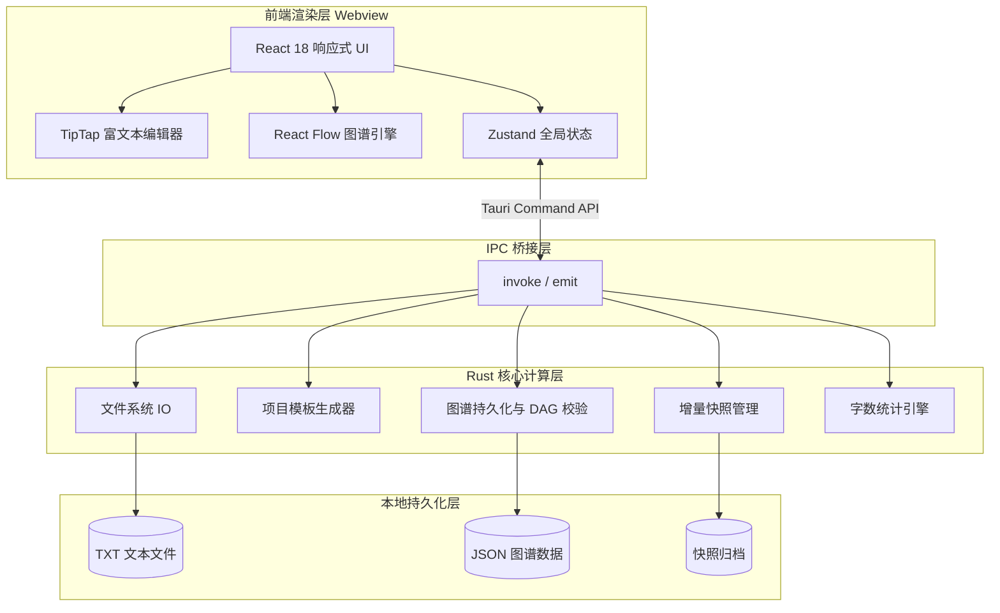

<div align="center">

# 喵创说 (MiaoChuangShuo)

**基于 Tauri 2.0 + React 18 的离线长篇创作工作站**

面向百万字级长篇小说创作场景, 采用前后端分离的桌面端架构, 将 UI 渲染与文件 IO、图谱计算等重型任务严格解耦, 保证主线程不阻塞。

</div>

---

## 软件简介

喵创说是一款专为独立与业余长篇创作者打造的本地化创作工作站, 坚持"完全离线、完全免费、数据归创作者所有"三大原则。项目针对长篇叙事工作流的特殊需求, 将富文本编辑、剧情时间线、人物关系图、智能设定库、命令面板五大核心模块集成于单一桌面应用, 让创作者无需在多个软件之间切换即可完成完整的长篇创作流程。

### 核心定位

- **面向人群**: 独立网文作者、业余小说爱好者、长篇连载作者、隐私敏感创作者、断网环境创作者、写作学习者
- **产品形态**: Windows 桌面端应用 (基于 Tauri 2.0, 安装包 10MB 以内)
- **核心价值**: 让长篇创作从碎片化走向工程化, 让创作工具回归创作者手中
- **公益属性**: 完全免费提供给独立与业余创作者群体, 服务无法承担云工具订阅费用的创作者, 数据 100% 本地存储, 不收集任何用户数据

### 技术特色

| 维度 | 实现 |
|------|------|
| 轻量化 | Tauri + Rust 替代 Electron, 安装包体积降低约 80%, 内存占用大幅减少 |
| 性能 | Rust 后端承载文件 IO、DAG 校验、字数统计, 前端保持 60fps 流畅滚动 |
| 安全 | 临时文件 + rename 原子写入, 防止崩溃导致数据损坏 |
| 隐私 | 完全离线运行, 无需账号登录, 数据主权 100% 归创作者 |
| 工程 | TypeScript strict 模式全量启用, 前后端类型对齐, Conventional Commits 规范 |

### 项目主页

- **在线体验版 (Web 版, 无需下载)**: [https://fanquanpp.github.io/MiaoChuangShuo/](https://fanquanpp.github.io/MiaoChuangShuo/)
- **在线展示 (报名网页)**: [https://fanquanpp.github.io/MiaoChuangShuo/docs/](https://fanquanpp.github.io/MiaoChuangShuo/docs/)
- **源码仓库**: [https://github.com/fanquanpp/MiaoChuangShuo](https://github.com/fanquanpp/MiaoChuangShuo)
- **发布下载**: [https://github.com/fanquanpp/MiaoChuangShuo/releases](https://github.com/fanquanpp/MiaoChuangShuo/releases)

> 在线体验版提供核心创作功能（富文本编辑、章节管理、字数统计、IndexedDB 持久化），适合快速试用。
> 桌面版提供完整功能（全文搜索、AI 助手、人物图谱、时间线、设定库、版本快照等）。
> 访问在线展示链接可查看完整产品介绍与界面预览, 含 15 张功能截图与 8 大章节内容说明。

---

<div align="center">

[](https://github.com/fanquanpp/MiaoChuangShuo/releases)
[](https://tauri.app/)
[](https://react.dev/)
[](https://www.rust-lang.org/)
[](https://www.typescriptlang.org/)
[](https://github.com/fanquanpp/MiaoChuangShuo/releases)

</div>

---

## 一、核心特性

### 1.1 富文本创作

- **TipTap 编辑器**: 基于 ProseMirror Document Model, 数据驱动渲染, 支持百万字级长文档
- **中文排版优化**: 首行缩进、中文引号自动配对、诗歌/歌词排版、智能 Tab 角色名选择
- **自定义语义节点**: SceneBreak 场景分割节点 (携带 povCharacterId/mood 元数据)、characterMention 角色 @ 提及节点
- **实时实体高亮**: Web Worker + Aho-Corasick 多模式匹配, 自动高亮设定库实体名称, 悬浮卡片展示角色详情

### 1.2 图谱可视化

- **剧情时间线**: 基于 React Flow 受控模式, 支持手动拖拽 + dagre LR 自动布局, DFS 三色标记法校验 DAG 无环
- **人物关系图**: 支持关系类型标签、关系描述编辑, 孤立节点按类型网格化分区布局, 消除遮挡
- **右键上下文菜单**: 剧情图谱与人物关系图均支持画布空白与节点右键菜单, 含新建节点/编辑/删除/自动布局/重置视图, 屏幕边界检测防溢出, Esc 键与外部点击关闭
- **节点详情抽屉**: 双向联动编辑, 边详情抽屉支持关系类型自定义

### 1.3 智能设定库 (Codex)

- **YAML front matter 结构化**: 设定文件使用 `---\n{"id":"...","aliases":[...],"relations":[...]}\n---\n正文` 格式
- **实体识别**: 自动扫描项目内所有 .txt/.pmd 文件, 统计实体出场次数与章节分布
- **别名支持**: 一个实体可拥有多个别名, 全部参与实体高亮匹配
- **AI-Ready 预留**: CodexEntity 接口预留 `ai_tags`/`embeddings` 字段, 为未来 RAG 检索留出位置
- **设定库与自定义分类联动**: 设定库 CRUD 自动同步 FileList 文件列表, FileList 增删改自动同步 Codex Store, 双向刷新闭环
- **Codex 保留目录拦截**: 自定义分类创建时拦截设定库兼容目录名 (角色/人物/世界观/设定/术语/名词/素材/资料), 避免目录冲突导致数据双向同步异常
- **.pmd 扩展名兼容**: FileList 显示/过滤/重命名/复制全链路兼容 .txt 与 .pmd 双扩展名, 重命名保留原扩展名避免格式降级
- **.pmd 转换边界限制**: NovelEditor.toPmdPath 仅对 Codex 目录下文件转换扩展名, 自定义分类文件保持原格式
- **编辑态精确控制**: CodexPanel 移除 selectedId effect 重置, 改为用户手动点击时重置编辑态, 程序化选中保留编辑态控制权
- **新建卡片精确选中**: 按名称+类型双重匹配, 避免同名跨类型卡片误选
- **正文内容预览**: 只读详情视图从 ProseMirror JSON 提取纯文本预览 (200字符截断), 无需进入编辑模式即可快速查看

### 1.4 全文搜索与索引

- **双后端搜索切换**: 全局搜索面板支持精确匹配 (按行扫描, 支持大小写与替换) 与语义搜索 (Tantivy 索引, 中文分词) 一键切换
- **Tantivy 全文索引**: Rust 原生搜索引擎 + tantivy-jieba 中文分词, 支持百万字级项目秒级检索
- **场景级 Chunk 切分**: Schema 包含 `scene_id`/`chunk_type` 字段, 按"场景"而非"段落"切分, 为 AI 上下文召回优化
- **增量索引更新**: 文件保存后 500ms 防抖触发 `update_file_index`, 文件删除/重命名自动清理索引文档, 项目首次打开自动后台全量构建
- **索引管理面板**: 设置面板内嵌索引统计 (文档数/文件数/索引大小/最后构建时间) + 构建/重建按钮 + 实时进度条
- **全局搜索与替换**: 支持区分大小写、跨文件批量替换, 替换前自动创建快照

### 1.5 项目管理

- **3 种文体模板**: 长短篇小说 (Novel) / 剧本与脚本 (Script) / 散文与文章 (Essay), 创建时自动生成 6 个标准目录
- **版本快照**: 增量快照归档, 支持项目级版本回溯, 写入前自动清理 .tmp 残留

### 1.6 AI 创作助手 (AI-1 ~ AI-4)

本项目采用 BYOK (Bring Your Own Key) 模式, 用户自带 OpenAI 兼容 API Key, 所有 AI 调用流式直连 LLM 服务, 不经任何第三方中转。AI 功能建立在 4 层上下文组装架构之上, 已完成编辑器端到端打通, 并支持 5 种任务类型切换:

| 阶段 | 能力 | 实现 |
|------|------|------|
| AI-1 BYOK 配置 | API Key/Base URL/Model 安全存储, SSE 流式管道 | `aiService.ts` + `ai_config.rs`, Base64 编码持久化 |
| AI-2 上下文组装 | 3 层上下文: 项目元信息 + 章节大纲 + 当前场景文本 | `ai_context.rs` + `promptBuilder.ts` + `sceneUtils.ts` |
| AI-3.1 工具栏触发 | 编辑器工具栏 AI 助手按钮, Ctrl+Shift+A 快捷键 | `EditorToolbar.tsx` + `NovelEditor.tsx` |
| AI-3.2 侧边栏对话 | 右侧滑出面板, 多轮对话历史, 流式输出, 插入到文档 | `AiAssistantPanel.tsx` |
| AI-3.4 选区右键菜单 | 润色/扩写/缩写/角色一致性检查, 角色悬停卡片 AI 操作 | `EditorBubbleMenu.tsx` + `CharacterHoverCard.tsx` |
| AI-4 多任务集成 | 5 种任务类型切换, 打通全部 PromptBuilder 构建方法 | `AiAssistantPanel.tsx` 任务类型切换栏 |

**Sprint 6 多任务类型 (AI-4)**:

| 任务类型 | 触发方式 | 上下文加载 | PromptBuilder 方法 |
|----------|----------|------------|-------------------|
| 续写 (continuation) | 默认 / 工具栏 / summarize-state | 场景上下文 (4 层) | `buildContinuationPrompt` |
| 对话生成 (dialogue) | 角色悬停卡片 generate-dialogue | 角色 + 场景上下文 | `buildDialoguePrompt` |
| 一致性校验 (consistencyCheck) | 选区 characterCheck / 手动切换 | 角色 + 选中文本 | `buildConsistencyCheckPrompt` |
| 剧情推演 (plotReview) | 面板手动切换 | 项目全局上下文 | `buildPlotReviewPrompt` |
| 大纲生成 (outlineGeneration) | 面板手动切换 | 项目全局上下文 | `buildOutlineGenerationPrompt` |

**4 层上下文组装链路**:

```
NovelEditor 光标位置
  └─ getCurrentSceneLocation() 识别当前场景
      └─ get_scene_context (Rust) 组装 4 层上下文
          └─ PromptBuilder.buildContinuationPrompt 构建 System+User Prompt
              └─ 用户指令追加到 System Prompt 末尾
                  └─ streamChatCompletion 流式调用 LLM
```

**Sprint 6 真实上下文数据**:

- `get_character_context`: 从设定库读取角色完整设定 + Tantivy 检索出场记录 + 人物关系图读取关系列表
- `get_project_context`: 读取项目元数据 + 提取主要角色/关键设定 + 扫描章节摘要 + 统计字数/章节数

**用户指令注入策略**: 不修改 `buildContinuationPrompt` 等签名, 通过 `${system}\n\n用户额外指令: ${instruction}` 追加, 保持零侵入。

**多轮对话 Token 控制**: 保留最近 8 条消息 (4 轮) 作为历史上下文, 避免 Token 爆炸。

### 1.7 AI-Ready 基础设施

本项目将全文索引、语义节点、设定库结构化视为"AI 就绪基础设施", 为 AI 创作助手提供底层支撑:

| 模块 | AI 价值 |
|------|---------|
| 设定库 YAML front matter | AI 的"世界观数据库", 结构化 ID/别名/关系供 RAG 检索 |
| SceneBreak 场景元数据 | AI 理解"剧情结构"的锚点 (povCharacterId/mood 强类型) |
| Tantivy 全文索引 | AI 的"海马体", 按场景 Chunk 快速召回相关上下文 |
| 实体高亮 + `entity:detected` 事件 | 为 AI 提供"当前场景有哪些角色在场"的实时数据流 |
| `ai_context.rs` 接口 | 统一 AI 上下文提取入口 (场景/角色/项目级真实数据实现) |
| `promptBuilder.ts` | 统一 Prompt 构建器, 5 种任务类型, 将 UserPreferences 开关注入 System Prompt |

---

## 二、快捷键

### 2.1 编辑器

| 快捷键 | 功能 |
|--------|------|
| `Ctrl + B` | 加粗 |
| `Ctrl + I` | 斜体 |
| `Ctrl + Shift + P` | 诗歌排版 |
| `Ctrl + Shift + L` | 歌词排版 |
| `Ctrl + Z` | 撤销 |
| `Ctrl + Shift + Z` | 重做 |
| `Ctrl + S` | 保存 |
| `Ctrl + Q` | 快速加引号 (中文双引号) |
| `Ctrl + =` | 增大字号 |
| `Ctrl + -` | 减小字号 |
| `Ctrl + 0` | 重置字号 |

### 2.2 段落操作

| 快捷键 | 功能 |
|--------|------|
| `Ctrl + L` | 选中当前段落 |
| `Ctrl + Shift + K` | 删除当前段落 |
| `Ctrl + Enter` | 在下方插入空段落 |
| `Shift + Alt + Down` | 复制当前段落到下方 |
| `Alt + Up` | 上移当前段落 |
| `Alt + Down` | 下移当前段落 |
| `Ctrl + ]` | 增加缩进 |
| `Ctrl + [` | 减少缩进 |
| `Tab` | 缩进选区 / 空行呼出角色名选择 |
| `Shift + Tab` | 减少缩进选区 |

### 2.3 全局

| 快捷键 | 功能 |
|--------|------|
| `?` | 打开/关闭快捷键参考面板 |
| `Ctrl + K` | 打开命令面板 |
| `Escape` | 关闭浮层/对话框 |
| `F11` | 进入/退出聚焦模式 |
| `Ctrl + F` | 打开查找替换面板 |
| `Ctrl + H` | 切换到替换模式 |
| `Ctrl + Shift + A` | 打开/关闭 AI 助手面板 |

### 2.4 侧边栏导航

| 快捷键 | 功能 |
|--------|------|
| `Alt + 1` | 切换到正文 |
| `Alt + 2` | 切换到大纲 |
| `Alt + 3` | 切换到设定库 |
| `Alt + 4` | 切换到统计 |
| `Alt + 5` | 切换到搜索 |

---

## 三、系统架构设计

<details>
<summary>点击展开架构图与设计要点</summary>

本项目采用桌面端 C/S 变体架构: 前端 Webview 负责渲染与交互, Rust 原生后端承载文件系统操作、图谱计算、模板生成等重型计算。两层通过 Tauri IPC 桥接层进行异步序列化通信。



### 架构设计要点

| 设计决策 | 实现方式 | 技术收益 |
|---------|---------|---------|
| 轻重分离 | 前端仅负责 UI 渲染, 文件 IO、正则匹配、DAG 校验全部下放至 Rust | 主线程保持 60fps, 长文档滚动不卡顿 |
| 类型安全 IPC | Rust 端 `#[serde(rename_all = "camelCase")]` 与前端 TypeScript 类型对齐 | 杜绝前后端字段大小写不匹配导致的反序列化错误 |
| 原子写入策略 | 临时文件写入 + rename 原子替换, 写入前清理 `.tmp` 残留 | 防止崩溃或断电导致 JSON 文件损坏 |
| 受控图谱 | React Flow 受控模式 + zundo pause/resume 精细化历史记录 | 拖拽节点时不产生过量撤销历史条目 |

</details>

---

## 四、技术栈选型

<details>
<summary>点击展开技术栈详情</summary>

| 层级 | 技术选型 | 选型理由 |
|------|---------|---------|
| 桌面框架 | Tauri 2.0 | 相比 Electron 内存占用降低约 80%, 安装包体积从 100MB+ 缩减至 10MB 以内, 原生支持 Rust 后端 |
| 前端框架 | React 18 + Vite 8 | 函数组件 + Hooks 模式适合构建复杂编辑器状态逻辑; Vite 提供毫秒级 HMR |
| 类型系统 | TypeScript 6 (strict) | 全量启用 strict 模式, 禁用 `any`/`unknown`, 通过 `Omit` 模式重建泛型类型避免索引签名污染 |
| 富文本引擎 | TipTap 2 (基于 ProseMirror) | 摒弃 `contenteditable` 直操作, 采用 Document Model 数据驱动, 支持自定义节点/标记扩展 |
| 状态管理 | Zustand 5 + zundo 2 | Zustand 轻量无 Provider; zundo temporal 中间件提供时间旅行式撤销/重做, 精确控制历史边界 |
| 图谱引擎 | @xyflow/react 12 + @dagrejs/dagre 1 | React Flow 提供受控节点/边系统; dagre 计算 LR 方向 DAG 自动布局 |
| 样式方案 | Tailwind CSS 3 + FANDEX 设计令牌 | 原子化 CSS 零运行时开销; 自定义 `nf-*` 命名空间避免与内置工具冲突 |
| 动画方案 | Framer Motion | 弹簧物理动画 (spring config: duration 0.4, bounce 0.15) 用于模板展开与卡片悬停 |
| 命令面板 | cmdk 1 | 提供类 VS Code 的 Ctrl+K 命令面板, 支持模糊搜索与分组 |
| 图标系统 | lucide-react | 统一 SVG 图标源, 按需引入, 无字体图标渲染开销 |
| 全文搜索 | Tantivy 0.22 + tantivy-jieba 0.11 | Rust 原生全文搜索引擎, jieba 中文分词, 为 AI 上下文召回提供基础 |
| 多模式匹配 | Aho-Corasick (Web Worker) | O(N+K) 实体名称匹配, 在 Web Worker 中运行避免阻塞主线程 |
| 后端语言 | Rust (stable) + Tauri Command | 内存安全保证本地数据不损坏; 零成本抽象提供原生级文件 IO 性能 |

</details>

---

## 五、核心模块与技术实现

<details>
<summary>点击展开核心模块技术实现细节</summary>

### 5.1 富文本编辑器引擎

**技术挑战**: 长篇小说单文档可达百万字级别, 传统 DOM 渲染在节点数超过 10 万时触发严重重排/重绘。

**解决方案**:
- 基于 TipTap 扩展机制构建自定义编辑器 `NovelEditor.tsx`, 通过 Document Model 数据驱动渲染, 仅更新变更的文档片段
- 自定义扩展模块: `autoPair.ts`(中文引号自动配对)、`indentParagraph.ts`(首行缩进)、`poetryFormat.ts`(诗歌排版)、`lineHighlight.ts`(当前行高亮)、`smartTab.ts`(智能 Tab 角色名选择)
- 输入法组合输入 (IME) 事件重构, 利用微任务队列延迟状态树更新, 避免组合输入中断
- `EditorBubbleMenu.tsx` 提供选区浮层工具栏, `EditorToolbar.tsx` 提供完整格式工具栏

### 5.2 图谱可视化引擎

**技术挑战**: 剧情时间线与人物关系图需要同时支持手动拖拽与自动布局, 且自动布局后不同类型节点不能互相遮挡。

**解决方案**:
- 基于 `@xyflow/react` 受控模式构建两套图谱系统: `TimelinePanel.tsx`(剧情时间线) 与 `CharacterGraphPanel.tsx`(人物关系图)
- `dagreLayout.ts` 实现分区布局算法: 有连线节点进入 dagre LR 布局 (nodesep=100, ranksep=140), 孤立节点按类型分组后网格化排列在主图下方, 从根源消除遮挡
- 自定义节点组件 `TimelineNode.tsx`/`CharacterGraphNode.tsx` 承载业务数据渲染, 自定义边组件 `TimelineEdge.tsx`/`CharacterGraphEdge.tsx` 实现关系标签中点渲染与点击编辑
- Rust 后端 `timeline_commands.rs` 实现有向无环图 (DAG) 校验, 采用 DFS 三色标记法防止循环依赖
- 节点详情抽屉 `TimelineDrawer.tsx`/`CharacterGraphDrawer.tsx` 支持双向联动编辑, 边详情抽屉 `CharacterGraphEdgeDrawer.tsx` 支持关系类型与描述的自定义编辑

### 5.3 撤销/重做系统

**技术挑战**: 富文本编辑器与图谱拖拽共享同一状态树, 需要精确控制历史记录边界, 避免拖拽过程产生过量历史条目。

**解决方案**:
- 采用 zundo temporal 中间件包裹 Zustand store, 提供时间旅行式状态回溯
- React Flow 受控模式下, 节点拖拽开始时调用 `pause()` 暂停历史记录, 拖拽结束后调用 `resume()` 提交单条历史
- `SnapshotHistory.tsx` 提供可视化历史快照面板, 支持跨时间点跳转

### 3.4 本地数据持久化

**技术挑战**: 离线场景下数据完整性依赖本地文件系统, 直接覆盖写容易在崩溃时导致数据损坏。

**解决方案**:
- Rust 后端 `fs_commands.rs` 封装所有文件 IO, 采用临时文件 + rename 原子写入策略
- 写入前自动清理 `.tmp` 残留文件, 防止上次崩溃遗留的临时文件干扰
- 图谱数据以 JSON 格式持久化, Rust 端 `#[serde(rename_all = "camelCase")]` 确保与前端 camelCase 字段对齐
- `snapshot_commands.rs` 实现增量快照归档, 支持项目级版本回溯

### 5.5 跨层类型安全

**技术挑战**: `@xyflow/react` v12 的 `NodeData extends Record<string, unknown>` 约束要求添加 `[key: string]: unknown` 索引签名, 与项目禁用 `unknown` 的规则冲突。

**解决方案**:
- 采用 `Omit<RFNode, "data" | "type">` 模式剥离基类型的 data/type 字段, 重新挂载业务类型
- 前后端 IPC 类型通过 Rust serde 序列化特性与 TypeScript 接口手工对齐, 关键结构体标注 `#[serde(rename_all = "camelCase")]`
- 全量启用 TypeScript strict 模式, ESLint 强制禁用 `any`/`unknown`, 所有函数参数与返回值显式标注

</details>

---

## 六、代码结构

<details>
<summary>点击展开代码结构树</summary>

项目遵循分层架构原则, 前后端代码严格解耦, 每个模块承担单一职责。

```
MiaoChuangShuo/
├── src-tauri/                          # Rust 后端核心
│   ├── src/
│   │   ├── lib.rs                      # Tauri 命令注册入口
│   │   ├── main.rs                     # 程序入口
│   │   ├── fs_commands.rs              # 文件系统 IO (原子写入、目录扫描)
│   │   ├── project_template.rs         # 项目模板生成器 (3 种标准文体)
│   │   ├── template_schema.rs          # 模板 Schema 定义与校验
│   │   ├── codex_commands.rs           # 设定库命令 (扫描、解析、YAML front matter)
│   │   ├── character_commands.rs       # 角色管理命令
│   │   ├── character_graph_commands.rs # 人物关系图持久化
│   │   ├── timeline_commands.rs        # 剧情时间线持久化与 DAG 校验
│   │   ├── snapshot_commands.rs        # 增量快照管理
│   │   ├── word_count.rs              # 字数统计引擎
│   │   ├── editor_preferences.rs       # 编辑器偏好配置 (用户级 + 项目级)
│   │   ├── text_extractor.rs          # 文本格式提取 (PlainText/Html/PmdJson/JsonFrontMatter)
│   │   ├── tantivy_indexer.rs         # Tantivy 全文索引器 (Schema + 分块索引)
│   │   ├── tantivy_search.rs          # Tantivy 全文搜索 (jieba 中文分词)
│   │   ├── ai_context.rs              # AI 上下文提取 (场景/角色/项目级 Mock 接口)
│   ├── Cargo.toml
│   ├── build.rs
│   └── tauri.conf.json
├── src/                                # React 前端
│   ├── components/                     # UI 组件层
│   │   ├── Launcher.tsx                # 主布局与项目看板
│   │   ├── ProjectCard.tsx             # 项目卡片
│   │   ├── Workspace.tsx               # 三栏工作台布局
│   │   ├── NovelEditor.tsx             # TipTap 编辑器
│   │   ├── Sidebar.tsx                 # 分类侧边栏
│   │   ├── FileList.tsx                # 文件列表
│   │   ├── TimelinePanel.tsx           # 剧情图谱画布
│   │   ├── TimelineNode.tsx            # 剧情自定义节点
│   │   ├── TimelineEdge.tsx            # 剧情自定义连线
│   │   ├── TimelineDrawer.tsx          # 剧情节点详情抽屉
│   │   ├── TimelineContextMenu.tsx     # 剧图右键菜单
│   │   ├── TimelineEmpty.tsx           # 剧情空状态
│   │   ├── CharacterGraphPanel.tsx     # 人物关系图画布
│   │   ├── CharacterGraphNode.tsx      # 人物自定义节点
│   │   ├── CharacterGraphEdge.tsx      # 人物关系连线
│   │   ├── CharacterGraphEdgeDrawer.tsx# 关系详情编辑抽屉
│   │   ├── CharacterGraphDrawer.tsx    # 人物节点详情抽屉
│   │   ├── CharacterGraphContextMenu.tsx# 人图右键菜单
│   │   ├── CharacterHoverCard.tsx      # 角色悬浮卡片
│   │   ├── CodexPanel.tsx             # 智能设定库面板
│   │   ├── CommandPalette.tsx          # cmdk 命令面板
│   │   ├── SnapshotHistory.tsx         # 版本快照面板
│   │   ├── WritingStats.tsx            # 写作统计面板
│   │   ├── GlobalSearch.tsx            # 全局搜索
│   │   ├── FindReplace.tsx             # 查找替换面板
│   │   ├── EditorToolbar.tsx           # 编辑器工具栏
│   │   ├── EditorBubbleMenu.tsx        # 选区浮层菜单
│   │   ├── CreateProjectDialog.tsx     # 项目创建对话框
│   │   ├── EditProjectDialog.tsx       # 编辑项目设定对话框
│   │   ├── CreateFileWizard.tsx        # 四步文件创建向导
│   │   ├── CreateFileDialog.tsx        # 快速创建文件对话框
│   │   ├── OutlineToChapters.tsx       # 大纲转章节
│   │   ├── TemplateManager.tsx         # 模板管理
│   │   ├── SettingsDialog.tsx          # 设置对话框
│   │   ├── ShortcutPanel.tsx           # 快捷键面板
│   │   ├── FocusTimer.tsx              # 聚焦计时器
│   │   ├── AiAssistantPanel.tsx        # AI 助手侧边栏面板 (多轮对话 + 流式输出)
│   │   ├── IndexManagerPanel.tsx       # 索引管理面板 (统计 + 构建 + 进度条)
│   │   ├── ErrorBoundary.tsx           # 渲染异常边界
│   │   ├── ContextMenu.tsx             # 通用右键菜单
│   │   ├── ConfirmDialog.tsx           # 统一确认/提示对话框
│   │   ├── WelcomeDialog.tsx           # 欢迎对话框
│   │   ├── UpdateNoticeDialog.tsx      # 版本更新通知对话框
│   │   ├── ProjectArchiveDialog.tsx    # 项目归档对话框
│   │   ├── GlobalTooltip.tsx           # 全局提示组件
│   │   ├── SkeletonComponents.tsx      # 骨架屏组件
│   │   └── ...                         # 其他辅助组件
│   ├── hooks/                          # 自定义 Hooks
│   │   ├── useAutoSaveOnExit.ts        # 退出自动保存
│   │   └── useWritingSession.ts        # 写作会话统计
│   ├── lib/                            # Service 与 Data 层
│   │   ├── store.ts                    # 全局 store 组合 (Zustand + zundo)
│   │   ├── api.ts                      # Tauri IPC 统一封装
│   │   ├── i18n.tsx                    # 国际化 (中/英)
│   │   ├── dagreLayout.ts              # dagre 自动布局算法
│   │   ├── timelineApi.ts              # 剧情图谱 API 封装
│   │   ├── characterGraphApi.ts        # 人图 API 封装
│   │   ├── codexApi.ts                 # 设定库 API 封装
│   │   ├── settingsStore.ts            # 设置持久化
│   │   ├── themeStore.ts               # 主题管理
│   │   ├── updateChecker.ts            # 版本更新检测
│   │   ├── wordCounter.ts              # 前端字数统计
│   │   ├── templateRegistry.ts         # 模板注册中心
│   │   ├── templateSchema.ts           # 模板 Schema
│   │   ├── categoryRegistry.ts         # 分类注册中心
│   │   ├── fileTreeUtils.ts            # 文件树工具
│   │   ├── recentFiles.ts              # 最近文件管理
│   │   ├── preferencesSlice.ts         # 编辑器功能开关状态切片
│   │   ├── uiStore.ts                  # UI 布局状态 (FileList 视图/Sidebar 折叠)
│   │   ├── eventBusSlice.ts            # Tauri 事件总线状态切片
│   │   ├── promptBuilder.ts            # AI Prompt 统一构建器 (System+User+Constraints)
│   │   ├── aiService.ts                # AI 服务层 (BYOK 配置 + SSE 流式调用)
│   │   ├── sceneBreak.ts              # 场景分割自定义节点 (pov/mood 元数据)
│   │   ├── entityHighlightPlugin.ts    # 实体高亮 ProseMirror 插件 (Decoration.inline)
│   │   ├── entityHighlightClient.ts    # 实体高亮 Web Worker 客户端
│   │   ├── entityHighlightWorker.ts    # Aho-Corasick 多模式匹配 Web Worker
│   │   ├── autoPair.ts                 # 引号自动配对
│   │   ├── characterMention.ts         # 角色 @ 提及
│   │   ├── indentParagraph.ts          # 首行缩进
│   │   ├── poetryFormat.ts             # 诗歌排版
│   │   ├── lineHighlight.ts            # 行高亮
│   │   ├── smartTab.ts                 # 智能 Tab
│   │   ├── fontSizeShortcut.ts         # 字号快捷键
│   │   ├── vscodeShortcuts.ts          # VS Code 快捷键映射
│   │   └── toast.tsx                   # 轻提示组件
│   ├── App.tsx
│   ├── main.tsx
│   └── styles.css
├── package.json
├── vite.config.ts
├── tailwind.config.js
├── tsconfig.json
└── README.md
```

</details>

---

## 七、工程化保障

### 7.1 代码规范

- **前端**: TypeScript strict 模式全量启用, 禁用 `any`/`unknown` 类型, 所有函数参数与返回值显式标注
- **后端**: Rust 编译器保证内存安全, `cargo check` 强制零警告
- **命名空间隔离**: Tailwind 自定义颜色使用 `nf-text`/`nf-bg`/`nf-border` 命名空间, 避免与内置 `text`/`bg`/`border` 工具冲突

### 7.2 构建校验链

每次有效代码变更提交前, 必须通过以下三项校验:

```bash
# 1. TypeScript 类型检查 + Vite 构建
npm run build

# 2. Rust 后端编译检查
cargo check --manifest-path src-tauri/Cargo.toml

# 3. Tauri 生产构建 (生成 MSI + NSIS 安装包)
npm run tauri build
```

### 7.3 版本号同步机制

版本号采用 `YY.MM.修改序号` 格式 (如 `26.7.24`), 以下 7 个位置必须保持同步:

| 文件 | 字段 |
|------|------|
| `package.json` | `version` |
| `src-tauri/Cargo.toml` | `version` |
| `src-tauri/Cargo.lock` | `version` (miaochuangshuo 包条目) |
| `src-tauri/tauri.conf.json` | `version` |
| `src/lib/updateChecker.ts` | `FALLBACK_VERSION` |
| `src/components/Launcher.tsx` | `appVersion` useState 初始值 |
| `src/components/SettingsDialog.tsx` | `currentVersion` useState 初始值 |

### 7.4 提交规范

遵循 Conventional Commits 规范, commit message 必须包含修改目的、修改范围、影响说明三项内容, 禁止无意义描述。

---

## 八、技术特色

<details>
<summary>点击展开技术特色细节</summary>

### 8.1 Windows HVCI 兼容性

Windows 11 HVCI (内存完整性) 会阻断 Rust 的 `Command::output()` 重叠 IO 操作。后端文件系统命令采用 `spawn()` + `read_to_end()` 同步 IO 替代重叠 IO, 保证在开启内存完整性的设备上正常运行。

### 8.2 图谱分区布局算法

`dagreLayout.ts` 实现的分区布局算法解决了传统 dagre 全量布局中孤立节点与有连线节点互相遮挡的问题:

1. **节点分组**: 遍历边列表, 将节点拆分为"有连线"与"孤立"两组
2. **主图布局**: 有连线节点进入 dagre LR 布局, 主线节点 Y 坐标强制对齐, `nodesep=100`/`ranksep=140` 增大间距
3. **孤立节点网格**: 孤立节点按 `main -> branch -> event -> ending` 类型分组, 在主图下方 (Y=600 起) 网格化排列, 每行最多 6 个
4. **坐标转换**: dagre 返回中心点坐标, 转换为 React Flow 所需的左上角坐标

### 8.3 React Flow 类型重建

为绕过 `@xyflow/react` v12 的 `NodeData extends Record<string, unknown>` 约束, 采用 `Omit` 模式重建类型:

```typescript
type RFNodeBase = Omit<RFNode, "data" | "type">;
export type TimelineNode = RFNodeBase & {
  data: TimelineNodeData;
  type: "storyNode";
};
```

此模式保留了 React Flow 节点的所有位置/尺寸字段, 同时用业务类型替换 data/type, 避免引入 `unknown` 索引签名。

### 8.4 原子写入防损坏

Rust 后端所有文件写入操作采用"临时文件 + rename"原子策略:

1. 写入 `.tmp` 临时文件
2. 写入完成后 rename 替换目标文件
3. 写入前清理上次崩溃可能遗留的 `.tmp` 残留

该策略保证即使在写入过程中崩溃或断电, 目标文件要么是完整的旧版本, 要么是完整的新版本, 不会出现半写入的损坏状态。

### 8.5 DAG 循环依赖校验

剧情时间线支持分支结构, 但禁止循环依赖。Rust 后端 `timeline_commands.rs` 采用 DFS 三色标记法 (白/灰/黑) 在持久化前校验图谱无环, 检测到回边时拒绝写入并返回错误。

### 8.6 .pmd 存储格式

正文文件采用 `.pmd` 扩展名存储 ProseMirror JSON 文档, 替代传统 `.txt` 纯文本格式:

- **格式定义**: `.pmd` 文件内容为纯 JSON (`{"type":"doc","content":[...]}`), 无 `---` front matter 包裹
- **设定文件区别**: 设定库文件使用 JSON front matter (`---\n{"id":"..."}\n---\n正文`), 由 codex 模块独立管理
- **原子写入**: 写入采用临时文件 + rename 原子策略, 保证崩溃或断电时文件不会半写入损坏
- **codex 内部转换**: 用户在设定库手动创建 .txt 文件时, `migrate_codex_txt_to_pmd` 命令自动转换为 .pmd 格式, 保证设定库格式一致性

### 8.7 Tantivy 全文索引

集成 Tantivy 搜索引擎 + tantivy-jieba 中文分词, 为 AI 功能提供"海马体"级语义召回能力:

- **Schema 设计**: 包含 `content`(文本)、`file_path`(路径)、`scene_id`(场景标识)、`chunk_type`(正文/设定/大纲) 字段, 支持按场景而非段落切分 Chunk
- **索引位置**: 索引数据存储于 `.novelforge/index/` 目录 (已加入 .gitignore), 索引损坏时可通过 `build_project_index` 命令重建
- **HVCI 兼容**: 全程使用 `std::fs` 同步 I/O, 不使用 `Command::output()`, 保证 Windows 11 内存完整性开启时正常运行
- **双后端搜索切换**: 全局搜索面板 (GlobalSearch.tsx) 支持"精确匹配"(searchInProject 按行扫描) 与"语义搜索"(searchProject 走 Tantivy) 一键切换, 精确匹配支持大小写与替换, 语义搜索支持中文分词与场景级 Chunk 召回
- **增量索引更新**: 编辑器保存后 500ms 防抖触发 `update_file_index` (先删后建策略); 文件删除/重命名时 FileList 自动清理对应索引文档 (.txt + .pmd 双路径); 项目首次打开时 Workspace 检测空索引并后台全量构建
- **索引管理面板**: IndexManagerPanel 嵌入设置对话框, 展示统计 (文档数/文件数/索引大小/最后构建时间) + 构建/重建按钮 + index-progress 事件实时进度条

</details>

---

## 九、快速开始

### 环境要求

- Node.js >= 18
- Rust (stable, 需安装 rustup)
- Windows 10/11 x64

### 本地开发

```bash
# 安装前端依赖
npm install

# 启动开发服务器 (Tauri 自动编译 Rust 后端)
npm run tauri dev
```

### 构建生产安装包

```bash
# 生成 MSI + NSIS 安装包
npm run tauri build
```

构建产物位于 `src-tauri/target/release/bundle/` 目录下。

### 9.3 桌面端发布流程

桌面端发布通过 GitHub Actions 自动化，流程如下：

1. 维护者更新版本号（同步 7 处位置）
2. 创建并推送 tag：`git tag v26.8.0 && git push origin v26.8.0`
3. GitHub Actions 自动触发 `release-desktop.yml` 工作流
4. 工作流在 `windows-latest` runner 上执行 `npm ci` → `npm run build` → `npm run tauri build`
5. 构建产物自动上传至 GitHub Release：
   - `MiaoChuangShuo_<version>_x64.msi`（MSI 安装包）
   - `MiaoChuangShuo_<version>_x64-setup.exe`（NSIS 安装包）
6. Release 自动生成 changelog 并发布

---

## 十、项目事项

### 10.1 安装包命名

安装包 `productName` 使用拼音 `MiaoChuangShuo` 而非中文字符, 避免 Windows 路径编码问题。GitHub Release 上传时使用纯英文文件名, 避免 gh CLI 在 Windows 上丢失中文字符。

### 10.2 图标系统

应用图标通过 `npx tauri icon` 从源图 (`src-tauri/icons/icon_source.svg` 或 `icon_source.png`) 一次性生成全平台图标 (Windows .ico / macOS .icns / Linux .png / iOS / Android), 保证视觉一致性。

**图标生成流程（唯一官方流程）**:

```bash
# 1. 准备源图（推荐 1024x1024 PNG 或 SVG）
#    源图位置: src-tauri/icons/icon_source.svg

# 2. 执行 Tauri 官方图标生成命令
npx tauri icon src-tauri/icons/icon_source.svg

# 3. 命令将自动生成以下文件:
#    - src-tauri/icons/icon.png            (512x512 主图标)
#    - src-tauri/icons/128x128.png         (128x128)
#    - src-tauri/icons/128x128@2x.png      (256x256)
#    - src-tauri/icons/32x32.png           (32x32)
#    - src-tauri/icons/icon.ico            (Windows 多尺寸 ICO)
#    - src-tauri/icons/icon.icns           (macOS ICNS)
#    以及 iOS / Android 各尺寸图标
```

**历史脚本归档说明**:

项目早期使用的 Python 图标生成脚本 `generate_icon.py` (基于 Pillow 绘制渐变背景 + 白色 M 字母) 已归档至 `scripts/archive/generate_icon.py`, 不再作为正式图标生成流程, 仅保留作为设计参考。所有图标更新均通过 `npx tauri icon` 流程完成, 避免双流程导致图标尺寸/格式不一致。

### 10.3 国际化

`i18n.tsx` 基于 React Context 实现轻量国际化, 支持中/英文切换, 所有用户可见文案集中管理于翻译字典, 组件通过 `useI18n()` Hook 获取翻译函数。

### 10.4 设计令牌

FANDEX 设计令牌集成于 Tailwind 配置, 定义三主色:
- 主色 `#6EA8FE` (蓝, 主线/师徒关系)
- 次色 `#55EFC4` (绿, 分支/亲属关系)
- 三色 `#F09070` (橙, 事件/同门关系)

辅以灰色系 (`zinc-*`) 构建暗色主题, 对标 VS Code / Godot 编辑器的视觉风格。

---

## 十一、许可协议

本项目仅供个人使用, 未经授权不得用于商业用途。
